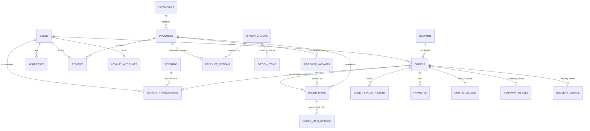

# L'Oven Coffee & Bakery — Database Architecture Documentation

## 1. System Overview & Technology Stack
- **DBMS**: MySQL 8.0+ / MariaDB 10.4+
- **Engine**: InnoDB (Full ACID compliance, Foreign Key Enforcement)
- **Character Set**: `utf8mb4`
- **Collation**: `utf8mb4_unicode_ci`
- **Framework Integration**: Laravel Eloquent ORM

---

## 2. Entity-Relationship Diagram (ERD)

---

## 3. Detailed Data Dictionary

### 3.1 User & Auth Domain

#### Table: `users`
Stores user identity, credentials, and access roles.
| Column | Type | Constraints | Description |
|---|---|---|---|
| `id` | BIGINT UNSIGNED | PK, Auto Increment | Primary key |
| `name` | VARCHAR(191) | NOT NULL | User's full name |
| `email` | VARCHAR(191) | NOT NULL, UNIQUE | User's email address |
| `phone` | VARCHAR(50) | NULL, UNIQUE | Contact phone number |
| `email_verified_at` | TIMESTAMP | NULL | Email verification timestamp |
| `password` | VARCHAR(255) | NOT NULL | Hashed password |
| `role` | ENUM | NOT NULL, Default: `'customer'` | `'customer'`, `'barista'`, `'kitchen'`, `'driver'`, `'admin'` |
| `avatar_url` | VARCHAR(255) | NULL | Profile image link |
| `remember_token` | VARCHAR(100) | NULL | Auth token |
| `created_at` | TIMESTAMP | NULL | Creation timestamp |
| `updated_at` | TIMESTAMP | NULL | Last modification timestamp |

#### Table: `addresses`
Stores delivery addresses for customer orders.
| Column | Type | Constraints | Description |
|---|---|---|---|
| `id` | BIGINT UNSIGNED | PK, Auto Increment | Primary key |
| `user_id` | BIGINT UNSIGNED | FK -> `users.id` (ON DELETE CASCADE) | Owner user ID |
| `label` | VARCHAR(100) | NOT NULL | Address label (e.g., "Home", "Work") |
| `recipient_name` | VARCHAR(191) | NOT NULL | Recipient full name |
| `recipient_phone` | VARCHAR(50) | NOT NULL | Recipient phone number |
| `street_address` | TEXT | NOT NULL | Building, street, apartment number |
| `city` | VARCHAR(100) | NOT NULL | City or area |
| `postal_code` | VARCHAR(20) | NULL | Postal/ZIP code |
| `delivery_instructions` | TEXT | NULL | Special instructions for delivery rider |
| `latitude` | DECIMAL(10, 8) | NULL | Geolocation latitude |
| `longitude` | DECIMAL(11, 8) | NULL | Geolocation longitude |
| `is_default` | BOOLEAN | Default: `FALSE` | Default delivery address flag |
| `created_at` | TIMESTAMP | NULL | Creation timestamp |
| `updated_at` | TIMESTAMP | NULL | Last modification timestamp |

---

### 3.2 Product & Catalog Domain

#### Table: `categories`
Organizes menu items into sections.
| Column | Type | Constraints | Description |
|---|---|---|---|
| `id` | BIGINT UNSIGNED | PK, Auto Increment | Primary key |
| `name` | VARCHAR(100) | NOT NULL | Category title |
| `slug` | VARCHAR(100) | NOT NULL, UNIQUE | URL-friendly identifier |
| `description` | TEXT | NULL | Summary of category |
| `image_url` | VARCHAR(255) | NULL | Category image asset |
| `display_order` | INT | Default: `0` | Sorting order |
| `is_active` | BOOLEAN | Default: `TRUE` | Visible in menu flag |
| `created_at` | TIMESTAMP | NULL | Creation timestamp |
| `updated_at` | TIMESTAMP | NULL | Last modification timestamp |

#### Table: `products`
Master catalog items.
| Column | Type | Constraints | Description |
|---|---|---|---|
| `id` | BIGINT UNSIGNED | PK, Auto Increment | Primary key |
| `category_id` | BIGINT UNSIGNED | FK -> `categories.id` (ON DELETE RESTRICT) | Associated category |
| `name` | VARCHAR(191) | NOT NULL | Product name |
| `slug` | VARCHAR(191) | NOT NULL, UNIQUE | URL-friendly slug |
| `description` | TEXT | NULL | Full description of ingredients/flavor notes |
| `price` | DECIMAL(10, 2) | NOT NULL | Base price |
| `image_url` | VARCHAR(255) | NULL | Primary product picture |
| `prep_time_mins` | INT UNSIGNED | Default: `5` | Estimated preparation time in minutes |
| `calories` | INT UNSIGNED | NULL | Calorie count |
| `is_available` | BOOLEAN | Default: `TRUE` | Stock/availability status |
| `is_featured` | BOOLEAN | Default: `FALSE` | Highlight on homepage |
| `created_at` | TIMESTAMP | NULL | Creation timestamp |
| `updated_at` | TIMESTAMP | NULL | Last modification timestamp |

#### Table: `product_variants`
Product sizes or packaging options (e.g. Small, Medium, Large, 12oz, 16oz).
| Column | Type | Constraints | Description |
|---|---|---|---|
| `id` | BIGINT UNSIGNED | PK, Auto Increment | Primary key |
| `product_id` | BIGINT UNSIGNED | FK -> `products.id` (ON DELETE CASCADE) | Parent product |
| `name` | VARCHAR(100) | NOT NULL | Variant label (e.g., "Regular 12oz", "Large 16oz") |
| `price_modifier` | DECIMAL(10, 2) | Default: `0.00` | Price added to base price |
| `sku` | VARCHAR(100) | NULL, UNIQUE | Stock keeping unit |
| `is_default` | BOOLEAN | Default: `FALSE` | Default selected variant |
| `created_at` | TIMESTAMP | NULL | Creation timestamp |
| `updated_at` | TIMESTAMP | NULL | Last modification timestamp |

#### Table: `option_groups`
Customization group definitions (e.g., "Milk Choice", "Sweetness Level", "Extra Shots").
| Column | Type | Constraints | Description |
|---|---|---|---|
| `id` | BIGINT UNSIGNED | PK, Auto Increment | Primary key |
| `name` | VARCHAR(100) | NOT NULL | Group header name |
| `description` | VARCHAR(255) | NULL | Helper text for customer |
| `is_required` | BOOLEAN | Default: `FALSE` | Customer must choose an item |
| `min_selectable` | INT | Default: `0` | Minimum choices allowed |
| `max_selectable` | INT | Default: `1` | Maximum choices allowed (1 = single choice, >1 = checkboxes) |
| `created_at` | TIMESTAMP | NULL | Creation timestamp |
| `updated_at` | TIMESTAMP | NULL | Last modification timestamp |

#### Table: `option_items`
Individual modifier choices within an option group.
| Column | Type | Constraints | Description |
|---|---|---|---|
| `id` | BIGINT UNSIGNED | PK, Auto Increment | Primary key |
| `option_group_id` | BIGINT UNSIGNED | FK -> `option_groups.id` (ON DELETE CASCADE) | Parent group |
| `name` | VARCHAR(100) | NOT NULL | Option name (e.g. "Oat Milk", "Vanilla Syrup", "Extra Espresso Shot") |
| `price_modifier` | DECIMAL(10, 2) | Default: `0.00` | Extra cost for this option |
| `is_available` | BOOLEAN | Default: `TRUE` | Availability status |
| `created_at` | TIMESTAMP | NULL | Creation timestamp |
| `updated_at` | TIMESTAMP | NULL | Last modification timestamp |

#### Table: `product_options`
Pivot table linking option groups to specific products.
| Column | Type | Constraints | Description |
|---|---|---|---|
| `id` | BIGINT UNSIGNED | PK, Auto Increment | Primary key |
| `product_id` | BIGINT UNSIGNED | FK -> `products.id` (ON DELETE CASCADE) | Product |
| `option_group_id` | BIGINT UNSIGNED | FK -> `option_groups.id` (ON DELETE CASCADE) | Option Group |
| `display_order` | INT | Default: `0` | Order of option display |

---

### 3.3 Multi-Fulfilment & Order Domain

#### Table: `orders`
Master order record.
| Column | Type | Constraints | Description |
|---|---|---|---|
| `id` | BIGINT UNSIGNED | PK, Auto Increment | Primary key |
| `order_number` | VARCHAR(32) | NOT NULL, UNIQUE | Customer facing code (e.g., `LOV-20260902-123`) |
| `user_id` | BIGINT UNSIGNED | NULL, FK -> `users.id` (ON DELETE SET NULL) | Registered user or NULL for guest |
| `fulfilment_type` | ENUM | NOT NULL | `'dine_in'`, `'takeaway'`, `'delivery'` |
| `status` | ENUM | NOT NULL, Default: `'pending'` | `'pending'`, `'confirmed'`, `'preparing'`, `'ready'`, `'out_for_delivery'`, `'completed'`, `'cancelled'` |
| `payment_status` | ENUM | NOT NULL, Default: `'unpaid'` | `'unpaid'`, `'paid'`, `'refunded'` |
| `coupon_id` | BIGINT UNSIGNED | NULL, FK -> `coupons.id` (ON DELETE SET NULL) | Applied coupon code |
| `subtotal` | DECIMAL(10, 2) | NOT NULL | Items total sum |
| `tax_amount` | DECIMAL(10, 2) | Default: `0.00` | Calculated tax |
| `delivery_fee` | DECIMAL(10, 2) | Default: `0.00` | Delivery fee |
| `discount_amount` | DECIMAL(10, 2) | Default: `0.00` | Applied discount sum |
| `total_amount` | DECIMAL(10, 2) | NOT NULL | Final total paid |
| `customer_notes` | TEXT | NULL | Special kitchen/barista notes |
| `cancellation_reason` | VARCHAR(255) | NULL | Stored reason if order cancelled |
| `created_at` | TIMESTAMP | NULL | Order creation timestamp |
| `updated_at` | TIMESTAMP | NULL | Last modification timestamp |

#### Table: `dine_in_details`
Extended details when `fulfilment_type = 'dine_in'`.
| Column | Type | Constraints | Description |
|---|---|---|---|
| `id` | BIGINT UNSIGNED | PK, Auto Increment | Primary key |
| `order_id` | BIGINT UNSIGNED | FK -> `orders.id` (ON DELETE CASCADE), UNIQUE | Associated order |
| `table_number` | VARCHAR(30) | NOT NULL | Allocated table identifier |
| `guest_count` | INT UNSIGNED | Default: `1` | Number of diners |

#### Table: `takeaway_details`
Extended details when `fulfilment_type = 'takeaway'`.
| Column | Type | Constraints | Description |
|---|---|---|---|
| `id` | BIGINT UNSIGNED | PK, Auto Increment | Primary key |
| `order_id` | BIGINT UNSIGNED | FK -> `orders.id` (ON DELETE CASCADE), UNIQUE | Associated order |
| `requested_pickup_at` | TIMESTAMP | NULL | Scheduled pickup time |
| `vehicle_description` | VARCHAR(100) | NULL | Car model/color for curbside pickup |

#### Table: `delivery_details`
Extended details when `fulfilment_type = 'delivery'`.
| Column | Type | Constraints | Description |
|---|---|---|---|
| `id` | BIGINT UNSIGNED | PK, Auto Increment | Primary key |
| `order_id` | BIGINT UNSIGNED | FK -> `orders.id` (ON DELETE CASCADE), UNIQUE | Associated order |
| `address_id` | BIGINT UNSIGNED | NULL, FK -> `addresses.id` (ON DELETE SET NULL) | Saved address referenced |
| `recipient_name` | VARCHAR(191) | NOT NULL | Recipient name |
| `recipient_phone` | VARCHAR(50) | NOT NULL | Recipient phone |
| `street_address` | TEXT | NOT NULL | Delivery address text |
| `city` | VARCHAR(100) | NOT NULL | City |
| `delivery_instructions` | TEXT | NULL | Gate code, instructions |
| `driver_id` | BIGINT UNSIGNED | NULL, FK -> `users.id` (ON DELETE SET NULL) | Assigned driver user |
| `estimated_delivery_at` | TIMESTAMP | NULL | ETA |
| `delivered_at` | TIMESTAMP | NULL | Actual delivery timestamp |

#### Table: `order_items`
Individual items within an order.
| Column | Type | Constraints | Description |
|---|---|---|---|
| `id` | BIGINT UNSIGNED | PK, Auto Increment | Primary key |
| `order_id` | BIGINT UNSIGNED | FK -> `orders.id` (ON DELETE CASCADE) | Parent order |
| `product_id` | BIGINT UNSIGNED | NULL, FK -> `products.id` (ON DELETE SET NULL) | Product link |
| `product_variant_id` | BIGINT UNSIGNED | NULL, FK -> `product_variants.id` (ON DELETE SET NULL) | Size/Variant link |
| `product_name` | VARCHAR(191) | NOT NULL | Snapshot product name |
| `variant_name` | VARCHAR(100) | NULL | Snapshot variant name |
| `unit_price` | DECIMAL(10, 2) | NOT NULL | Unit price at time of order |
| `quantity` | INT UNSIGNED | NOT NULL | Quantity ordered |
| `line_total` | DECIMAL(10, 2) | NOT NULL | `(unit_price + options_cost) * quantity` |
| `item_notes` | VARCHAR(255) | NULL | Custom item note |

#### Table: `order_item_options`
Selected modifiers for an order item.
| Column | Type | Constraints | Description |
|---|---|---|---|
| `id` | BIGINT UNSIGNED | PK, Auto Increment | Primary key |
| `order_item_id` | BIGINT UNSIGNED | FK -> `order_items.id` (ON DELETE CASCADE) | Parent order item |
| `option_item_id` | BIGINT UNSIGNED | NULL, FK -> `option_items.id` (ON DELETE SET NULL) | Option choice |
| `option_group_name` | VARCHAR(100) | NOT NULL | Snapshot group name (e.g. "Milk") |
| `option_item_name` | VARCHAR(100) | NOT NULL | Snapshot item name (e.g. "Oat Milk") |
| `price_modifier` | DECIMAL(10, 2) | Default: `0.00` | Snapshot price modifier |

#### Table: `order_status_history`
Timestamped record of order progression.
| Column | Type | Constraints | Description |
|---|---|---|---|
| `id` | BIGINT UNSIGNED | PK, Auto Increment | Primary key |
| `order_id` | BIGINT UNSIGNED | FK -> `orders.id` (ON DELETE CASCADE) | Order |
| `status` | ENUM | NOT NULL | New status code |
| `changed_by` | BIGINT UNSIGNED | NULL, FK -> `users.id` (ON DELETE SET NULL) | User/Staff who updated status |
| `notes` | VARCHAR(255) | NULL | System or staff status message |
| `created_at` | TIMESTAMP | NULL | Transition timestamp |

---

### 3.4 Loyalty Points & Rewards Domain

#### Table: `loyalty_accounts`
Tracks customer rewards account.
| Column | Type | Constraints | Description |
|---|---|---|---|
| `id` | BIGINT UNSIGNED | PK, Auto Increment | Primary key |
| `user_id` | BIGINT UNSIGNED | NOT NULL, FK -> `users.id` (ON DELETE CASCADE), UNIQUE | Customer user |
| `current_points` | INT UNSIGNED | Default: `0` | Spendable points balance |
| `lifetime_points` | INT UNSIGNED | Default: `0` | Cumulative earned points |
| `tier` | ENUM | Default: `'bronze'` | `'bronze'`, `'silver'`, `'gold'`, `'platinum'` |
| `created_at` | TIMESTAMP | NULL | Creation timestamp |
| `updated_at` | TIMESTAMP | NULL | Last modification timestamp |

#### Table: `rewards`
Redeemable reward items or discounts catalog.
| Column | Type | Constraints | Description |
|---|---|---|---|
| `id` | BIGINT UNSIGNED | PK, Auto Increment | Primary key |
| `title` | VARCHAR(191) | NOT NULL | Reward title (e.g., "Free Medium Coffee") |
| `description` | TEXT | NULL | Conditions and description |
| `points_required` | INT UNSIGNED | NOT NULL | Points needed to redeem |
| `discount_type` | ENUM | NOT NULL | `'free_product'`, `'fixed_amount'`, `'percentage'` |
| `discount_value` | DECIMAL(10, 2) | Default: `0.00` | Discount monetary amount or % |
| `product_id` | BIGINT UNSIGNED | NULL, FK -> `products.id` (ON DELETE SET NULL) | Product if free item |
| `is_active` | BOOLEAN | Default: `TRUE` | Active flag |
| `created_at` | TIMESTAMP | NULL | Creation timestamp |
| `updated_at` | TIMESTAMP | NULL | Last modification timestamp |

#### Table: `loyalty_transactions`
Auditable log of point earnings and redemptions.
| Column | Type | Constraints | Description |
|---|---|---|---|
| `id` | BIGINT UNSIGNED | PK, Auto Increment | Primary key |
| `user_id` | BIGINT UNSIGNED | FK -> `users.id` (ON DELETE CASCADE) | Customer |
| `order_id` | BIGINT UNSIGNED | NULL, FK -> `orders.id` (ON DELETE SET NULL) | Associated order |
| `reward_id` | BIGINT UNSIGNED | NULL, FK -> `rewards.id` (ON DELETE SET NULL) | Redeemed reward |
| `transaction_type` | ENUM | NOT NULL | `'earned'`, `'redeemed'`, `'expired'`, `'adjusted'` |
| `points` | INT | NOT NULL | Points added (+10) or deducted (-100) |
| `balance_after` | INT UNSIGNED | NOT NULL | Resulting balance |
| `description` | VARCHAR(255) | NULL | Narrative (e.g. "Points earned on order #LOV-1001") |
| `created_at` | TIMESTAMP | NULL | Transaction timestamp |

---

### 3.5 Payments, Discounts & Reviews Domain

#### Table: `payments`
Payment processor integration records.
| Column | Type | Constraints | Description |
|---|---|---|---|
| `id` | BIGINT UNSIGNED | PK, Auto Increment | Primary key |
| `order_id` | BIGINT UNSIGNED | FK -> `orders.id` (ON DELETE CASCADE) | Parent order |
| `payment_method` | ENUM | NOT NULL | `'card'`, `'mpesa'`, `'cash'`, `'apple_pay'`, `'google_pay'` |
| `transaction_reference` | VARCHAR(191) | NULL, UNIQUE | Gateway transaction ref |
| `amount` | DECIMAL(10, 2) | NOT NULL | Payment amount |
| `status` | ENUM | NOT NULL, Default: `'pending'` | `'pending'`, `'completed'`, `'failed'`, `'refunded'` |
| `payment_gateway_response` | JSON | NULL | Raw gateway response data |
| `created_at` | TIMESTAMP | NULL | Payment timestamp |
| `updated_at` | TIMESTAMP | NULL | Last modification timestamp |

#### Table: `coupons`
Promotions and coupon vouchers.
| Column | Type | Constraints | Description |
|---|---|---|---|
| `id` | BIGINT UNSIGNED | PK, Auto Increment | Primary key |
| `code` | VARCHAR(50) | NOT NULL, UNIQUE | Coupon promo code (e.g. `LOVEN10`) |
| `discount_type` | ENUM | NOT NULL | `'percentage'`, `'fixed_amount'` |
| `discount_value` | DECIMAL(10, 2) | NOT NULL | Discount value |
| `min_order_amount` | DECIMAL(10, 2) | Default: `0.00` | Minimum basket requirement |
| `max_discount_amount` | DECIMAL(10, 2) | NULL | Cap for percentage discounts |
| `usage_limit` | INT UNSIGNED | NULL | Maximum global redemptions |
| `used_count` | INT UNSIGNED | Default: `0` | Times redeemed |
| `starts_at` | TIMESTAMP | NULL | Valid start date |
| `expires_at` | TIMESTAMP | NULL | Expiration date |
| `is_active` | BOOLEAN | Default: `TRUE` | Active flag |
| `created_at` | TIMESTAMP | NULL | Creation timestamp |
| `updated_at` | TIMESTAMP | NULL | Last modification timestamp |

#### Table: `reviews`
Ratings and customer feedback.
| Column | Type | Constraints | Description |
|---|---|---|---|
| `id` | BIGINT UNSIGNED | PK, Auto Increment | Primary key |
| `user_id` | BIGINT UNSIGNED | FK -> `users.id` (ON DELETE CASCADE) | Customer |
| `product_id` | BIGINT UNSIGNED | FK -> `products.id` (ON DELETE CASCADE) | Product rated |
| `order_id` | BIGINT UNSIGNED | NULL, FK -> `orders.id` (ON DELETE SET NULL) | Order verified |
| `rating` | TINYINT UNSIGNED | NOT NULL | 1 to 5 rating |
| `comment` | TEXT | NULL | Feedback text |
| `created_at` | TIMESTAMP | NULL | Review timestamp |

---

## 4. Performance & Indexing Strategy
1. **Primary Lookup Indexes**:
   - `users(email)`
   - `orders(order_number)`
   - `categories(slug)`, `products(slug)`
   - `coupons(code)`
2. **Order Lifecycle Queries**:
   - Composite index `orders(status, fulfilment_type, created_at)` for live kitchen/barista/delivery dashboards.
3. **Foreign Key Indexes**:
   - Indexed automatically on `user_id`, `product_id`, `category_id`, `order_id` for fast join performance.
